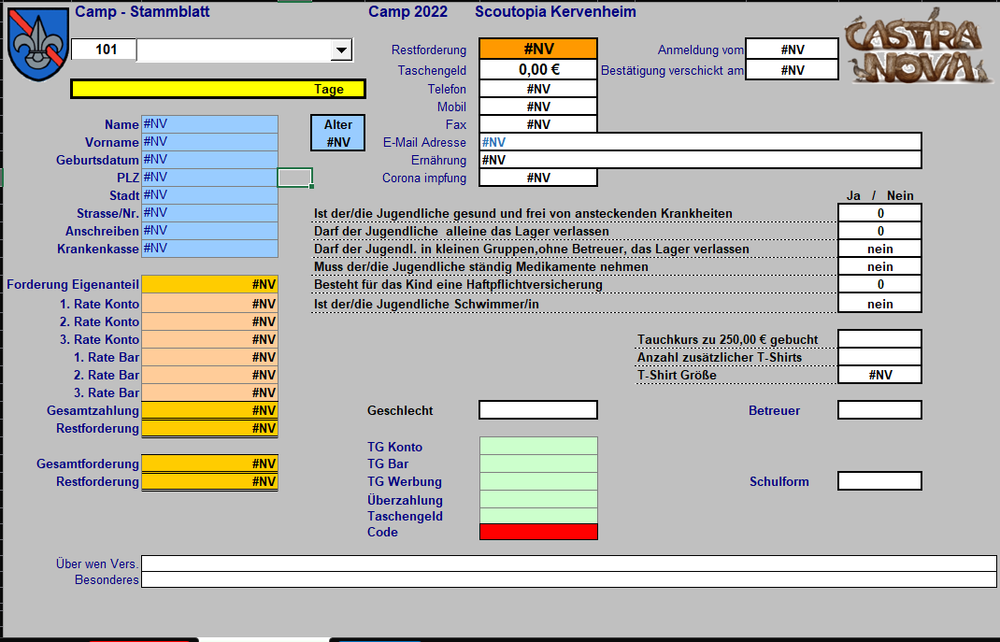
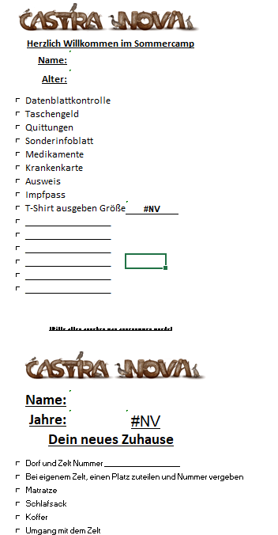
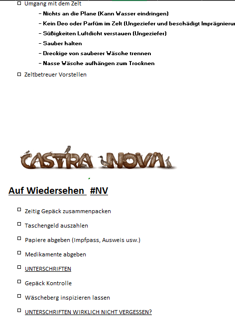

# Kinderverwaltung

## Description

This Software is made to manage the partipiants of a camp.

## Steps of Develpement

- [ ] Create a good DB
- [ ] Create something to enter Data into the db
- [ ] Create somthing for pocketmoney
- [ ] somthing for the anmenlung
- [ ] somthing to edit data
- [ ] abmeldung

### entry of Data

- using web somthing
- has to be sanitsed
- confirmation email

## files that need to be printed

## requierd DB stuff that I extracted from Excel
### Taschengeld input
Name;Vorname;erster;letzter;TG;Tgkonto;TG Überzah;TG Überwiesen;Tgbar;Werbung;Bargesamt; Noch in Kasse 

### mensch
Name;Vorname;Geburtsdatum;Alter;Geschlecht;Nationalität;Krankenkasse;Anmeldung vom; Versicherter;Bestätigung verschickt am;Erinnerung;Schulform;Corona impfung;Ernährung;  T- Shirt Größe;  L=Leiter M=Mitarbeiter;Besonderes;

PLZ;Stadt;Strasse/Nr.;Anschreiben;Bundesland;Telefon;Fax;Mobil;E-Mail Adresse

### Dateneingabe
Code;

Tagessatz;Forderung Eigenanteil;Restforderung;1. Rate Konto;2. Rate Konto;3. Rate Konto;1. Rate Bar;2. Rate Bar;3. Rate Bar;Gesamtzahlung;Gesamtforderung;Gesamt noch offen;Taschengeld;TG Konto;TG Bar;TG Werbung;Überzahlt;RÜCK-ZAHLUNG;

Gesund;Medikament;Haftpflicht;

allein;Kleine Gruppe;Schwimmer;Tauchkurs;

### Team

Bauten und Instandhaltung;Auf-Abbau;Gruppen betreuung;Programmgestaltung;Küche;Einkauf;Organisation und Planung;Leitung, Büro und Abrechnung;Sonstige Arbeiten;

Ausbildungen/Seminare;

Eigenes Zelt;

KFZ dabei;B;BE;C1;C1E;C;CE;

### dropdown

ohne
H2410
Familie10%
Familie3%
Familie5%
Fr10%+Fam10%
Fr10%+Fam3%
Fr10%+Fam5%
Früh10%
H2410+Fr10%
Mitglieder
Mitglieder früh
Sonderrabatt
Mitarbeiter
Flüchtling

Grundschule
Hauptschule
Förderschule
Realschule
Gymnasium
Gesamtschule
Sekundarschule
Waldorfschule
Sonstige

118-128
130-140
142-152
XS
S
M
L
XL
XXL
XXXL

ja
nein

normal
vegetarisch
vegan
Halal

männlich
weiblich
divers